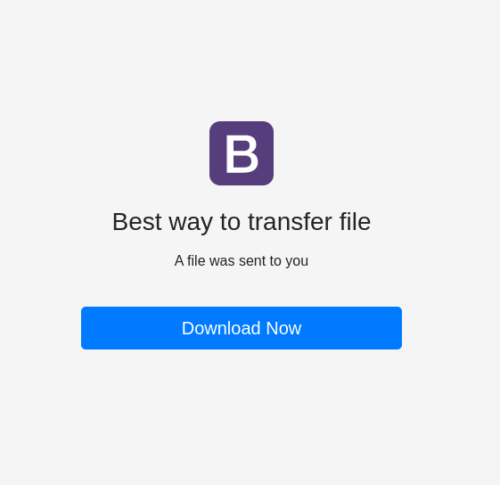
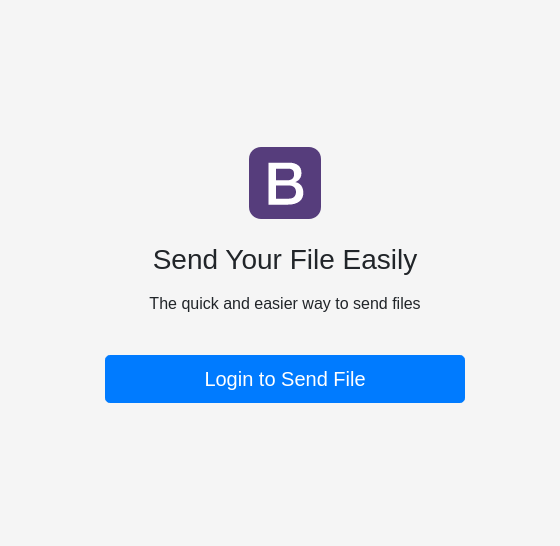
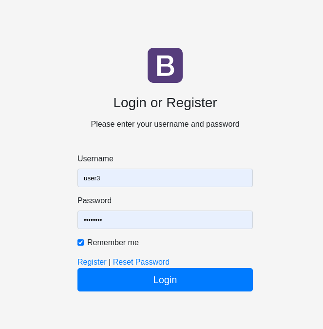
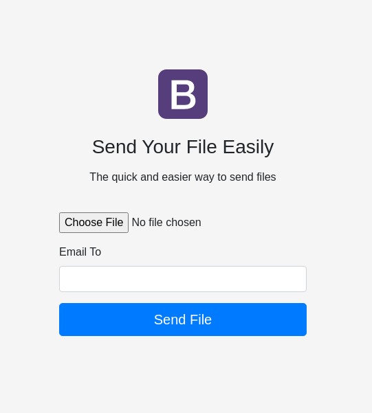

# One CakePHP project a day challenge - Day 10 File Transfer

On this project I'm using CakePHP 4, CakeDC/Users plugin, friendsofcake/bootstrap-ui plugin, Josegonzalez/Upload plugin and Bootstrap 4

## Steps to create this project

- e22bf38 Init and bootstrap basic
  ```
  composer create-project --prefer-dist cakephp/app
  ```
- e5bc20b Added CakeDC/Users plugin (with migrations, permissions and clean users.php)
  ```
   composer require cakedc/users
   cp vendor/cakedc/users/config/Migrations/201* config/Migrations/
  ```
- 794f754 Main table migrations:
  ```
  bin/cake bake migration CreateTransfers file file_dir user_id:uuid email_to created
  bin/cake migrations migrate
  bin/cake bake model Transfers
  ```
- d763bbd Added plugin friendsofcake/bootstrap-ui:
  ```
  composer require friendsofcake/bootstrap-ui
  bin/cake plugin load BootstrapUI
  bin/cake bootstrap install
  bin/cake bootstrap modify_view
  bin/cake bootstrap copy_layouts
  ```
- a21abc7 Use SMTP for email
- 9ceb4fe Added plugin Josegonzalez/Upload
- 5cd26ce Added base page to send file
- ac6f02f Upload file using plugin Josegonzalez/Upload
- 8e1f736 update transfers table with security key
- 6fd2a59 Sent email to user with link to download the file
- 83291a5 clear up
- f1aae2e Added action to download the file
- 50eaeb3 clean up
- 693fc6e Added new home page
- af79ad0 Styled login page
- 8818e63 Update message and avoid error message


## Pages








